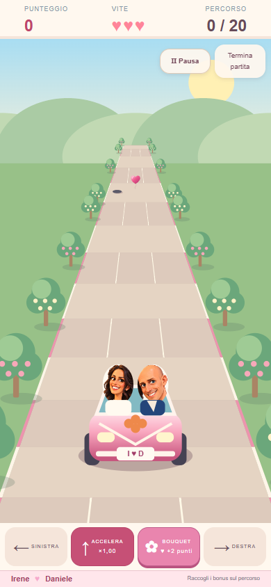
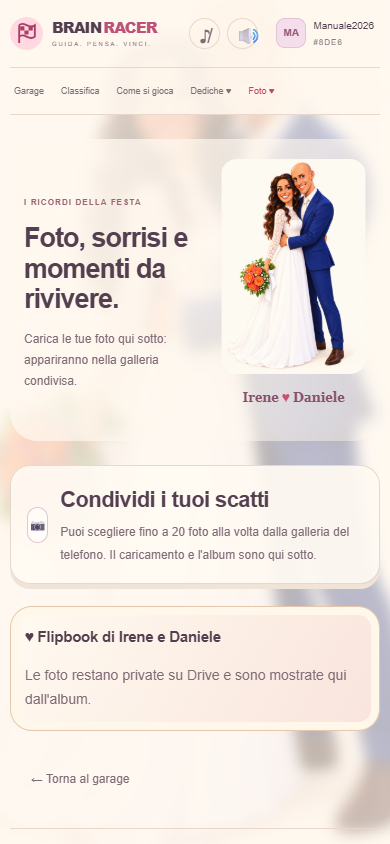

# Manuale utente Brain Racer

Guida rapida per giocare, lasciare una dedica e condividere le foto della festa di Irene e Daniele.

Web app: <https://irenedaniele.streamlit.app/>

## Iniziare a giocare

1. Apri la web app dal telefono, dal tablet o dal computer.
2. Scrivi un nickname di 3-16 caratteri e premi **Gioca**.
3. Nel Garage trovi subito, nello stesso formato: **📸 Condividi le foto della festa**, **🏁 Gioca** e **🔐 Area Sposi**.
4. Usa **Sinistra** e **Destra** per sterzare e tieni premuto **Accelera** per aumentare la velocità.
5. Sul touchscreen premi la pista per lanciare il bouquet contro i palloncini a cuore.
6. Al traguardo rispondi alle tre domande. Verde significa risposta corretta, rosso risposta errata.
7. Dopo Game Over premi **Gioca ancora** per ripartire.

## Lasciare una dedica

1. Dal menu scegli **Dediche ♥**.
2. Scrivi il messaggio per Irene e Daniele, fino a 800 caratteri.
3. Premi **Salva la dedica**.
4. La dedica sarà visibile nel libro degli ospiti con il tuo nickname e potrà essere aggiornata.

## Foto e Flipbook

1. Dal Garage premi **Carica le tue foto**, oppure dal menu scegli **Foto ♥**: l'accesso dal Garage porta direttamente al selettore.
2. Premi **Scegli le foto** e seleziona fino a 20 scatti dalla galleria del telefono. Puoi restare nella galleria tutto il tempo necessario.
3. Sono accettati JPG, JPEG, PNG, WebP, HEIC e HEIF, massimo 20 MB ciascuno.
4. Premi **Carica le foto** e attendi la conferma.
5. Premi **Mostra tutte le foto della festa** per aprire volontariamente la galleria condivisa.

Su Drive il nome viene salvato nel formato `MMDDYY_nickname_nomeoriginale`, per esempio `091726_max_foto1.jpg`.

Il pulsante **♥ Apri il Flipbook** si attiva quando gli sposi pubblicano almeno una foto. Usa **Precedente** e **Successiva** per sfogliarlo.

## Area riservata Irene e Daniele

1. Apri **🔐 Area Sposi** dal menu dorato o dal Garage e inserisci la password degli sposi.
2. Seleziona più foto oppure usa **Seleziona tutte**.
3. Usa **Pubblica nel Flipbook**, **Rimuovi dal Flipbook** o **Elimina selezionate**.
4. Nella sezione **Ordine del Flipbook** scegli il numero e premi **Assegna**: le due foto si scambiano la posizione.
5. Nella preselezione attiva **Vista a griglia** per vedere tre miniature per riga anche sul telefono. Le foto nel Flipbook hanno il bordo verde; quelle selezionate il bordo giallo.
6. Usa le frecce per spostare una foto di un posto oppure attiva la **Vista compatta a griglia** nell'ordinamento.
7. Quando l'ordine è definitivo premi **Blocca**: quella posizione resta riservata. Premi **Sblocca** per modificarla.
8. La cancellazione richiede una conferma.
9. **Annulla selezione** deseleziona tutte le immagini.

## Se qualcosa non risponde

Controlla la connessione, attendi qualche secondo e riprova. Per molte foto usa gruppi più piccoli. Dopo un aggiornamento di Streamlit ricarica completamente la pagina.
